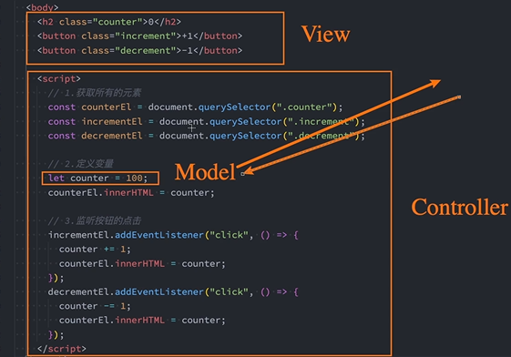
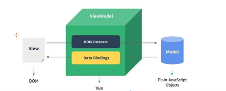
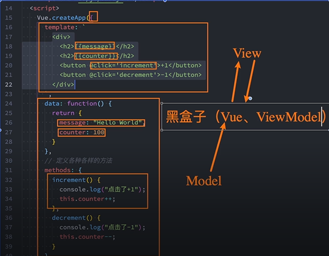

# vue3的引入

## CND
### CDN的理解
即Content Delivery Network， 内容分发网络
- 他是指通过相互连接的网络系统，利用最靠近每个用户的服务器
- 更快，更可靠的将音乐，图片，视频，应用程序及其他文件发送给用户
- 来提供高性能，可扩展及低成本的网络内容传递给用户

### CDN的种类
- 自己的CDN服务器：需要购买自己的CDN服务器，目前阿里，腾讯，亚马逊，Google可以购买CND服务器
- 开源的CDN服务器：国际上用得比较多的unpkg，JSDeliver， cdnjs

## 下载引入（略）

# 计数器案例
- 点击按钮+1：数字加一
- 点击按钮-1：数字减一

# 声明式编程 & 命令式编程 两种编程范式
命令式编程关注的是how to do
声明式编程关注的是what to do
框架来完成how的过程

# MVVM & MVC
- MVC
  Model-View-Controlle,是在前期被流行使用的架构模式，比如IOS，原生的前端开发
  

- MVVM
  Model-Vuew-ViewModel，是目前非常流行的架构模式
  

- 通常情况，也称Vue是一个MVVM的模型，虽然并没有完全遵循MVVM模型，但是整个设计都受到它的启发
  

# template属性
渲染的模板信息，{{}}， 指令等模板语法

## 易于书写的方式
- 使用scipt标签没并且将它类型标记成x-template
- 使用任意的标签，设置id

# methods的this
 
## 为什么不能使用箭头函数
methods中方法使用箭头函数时，里面的this指向window
## 不是用箭头函数的情况下，this指向哪里